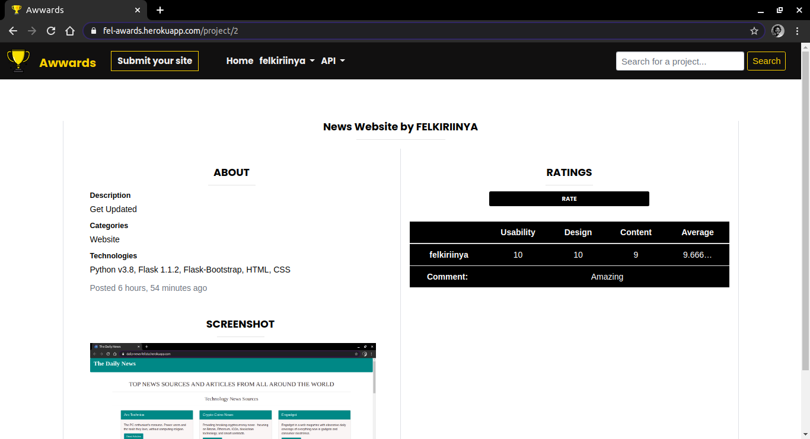

# Awards
#### The application allows a user to post a project he/she has created and get it reviewed by his/her peers, 27/11/2020.
#### By Felista Kiriinya

## Description

## Live link
Visit the application on https://fel-awards.herokuapp.com/.

## Figma Link
This is the [figma](https://www.figma.com/file/rfJq82UvKCokjbBvQSkcPB/Awards?node-id=0%3A1) link to my design.

## Development
To make advancements/modifications, follow these steps:

- Fork the repository
- Create a new branch (`git checkout -b improve-feature`)
- Make the appropriate changes in the files
- Add changes made
- Commit your changes (`git commit -am 'Improve feature'`)
- Push to the branch (`git push origin improve-feature`)
- Create a Pull Request 

## Technologies Used
Technologies used to develop this application:

1. Python v3.8
2. Django 3.1.3
3. Django-Bootstrap
4. HTML 
5. CSS

## Support and contact details

Should you be unable to access the website, have any recommendations and/or questions, feel free to email me:[felkiriinya@gmail.com](mailto:felkiriinya@gmail.com)

## [License](https://github.com/felkiriinya/Awards/blob/main/LICENSE)

Copyright (c) 2020 [Felista Kiriinya](https://github.com/felkiriinya)
